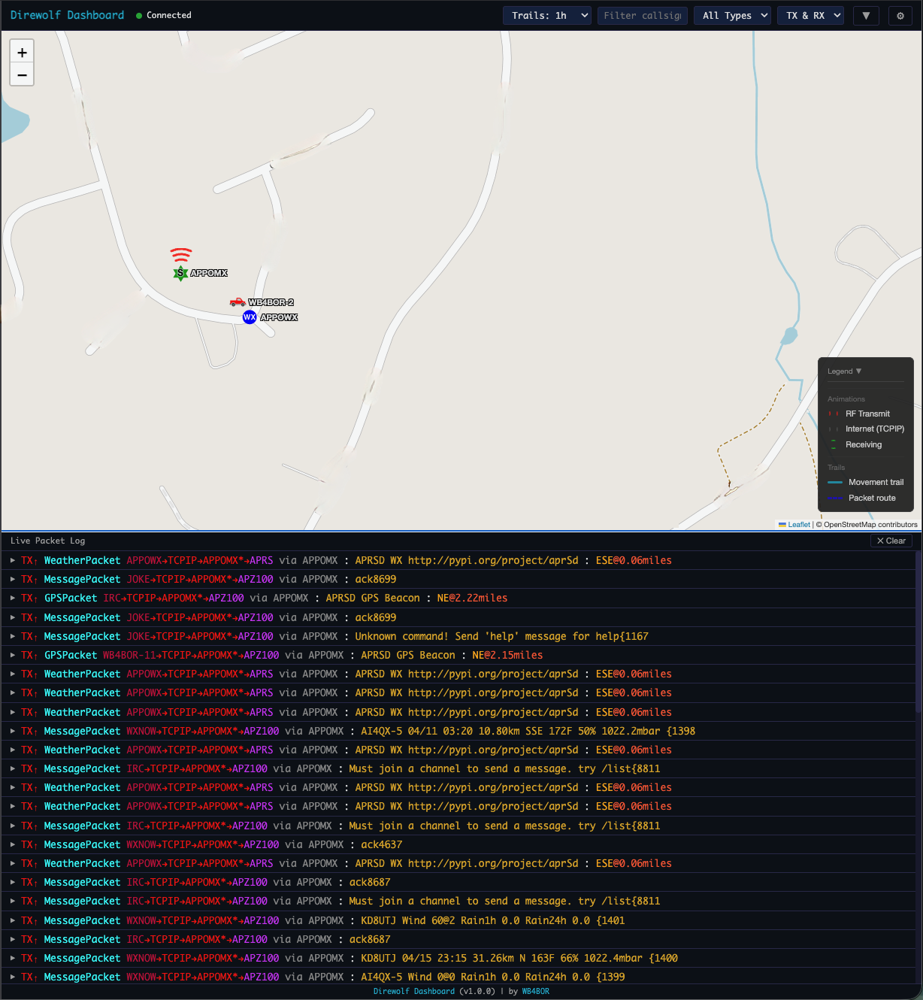

# Direwolf Dashboard

A lightweight, web-based live display of [Direwolf](https://github.com/wb2osz/direwolf) TNC activity. Designed to run on a **Raspberry Pi Zero 2W** — shows a live map of APRS stations and a scrolling packet log in your browser.



## Features

### Map & Stations
- **Live Leaflet map** with APRS symbol icons, callsign labels, and movement trails
- **Live stats overlay** — station count, packet count, packets/hour, tile cache size, and server uptime (togglable in Settings)
- **Animated RF activity** — transmit/receive arc animations with packet route visualization via digipeaters and IGates
- **Collapsible map legend** showing animation and trail symbols
- **Trail duration selector** — choose 1h, 2h, 6h, or 24h of station movement history
- **⛅ Weather Stations panel** (`W`) — sortable table of all weather stations heard with current temp, wind, humidity, and pressure; map popups for weather stations show current conditions inline
- **📋 Station List panel** (`S`) — sortable, filterable table of every station heard with live age, packet count, position, and one-click CSV export

### Packet Log
- **Scrolling packet log** formatted in [APRSD](https://github.com/craigerl/aprsd) compact style with color-coded TX/RX, callsigns, paths, and bearing/distance
- **Three-state packet log** — toggle between expanded (50/50 split), peek (3–4 rows), or hidden (full-screen map) with toolbar button or `L` key; state persists across sessions
- **Inline raw log toggle** — click any packet to expand the raw Direwolf log lines
- **📶 Audio level / signal quality bars** — RX packets with an audio level show a 5-bar strength indicator; top bars yellow/red for strong or overloaded signals
- **🎨 Configurable log colors** — all 8 color slots (RX, TX, type, comment, human info, bearing, distance, dim) editable via color pickers in Settings; saved to `localStorage`
- **🔍 Full-text search** — `Ctrl+F` focuses a live search box that filters the log by callsign, raw packet, comment, or human info

### APRS Messaging
- **💬 APRS Messages panel** (`M`) — all `MessagePacket` traffic grouped into per-conversation threads; threads addressed to your callsign highlighted blue and sorted first

### Filters
- **Callsign filter** — live filter log rows and map markers by callsign fragment
- **Type filter** — show only GPS, Message, Weather, Status, Object, or Telemetry packets
- **TX/RX filter** — show only transmitted or received packets
- **Full-text search** — search across raw packet data and all decoded fields simultaneously

### Tools
- **APRS packet decoder** (`Ctrl+K`) — paste any raw APRS string and see a structured decode
- **⌨ Keyboard shortcuts help** (`?`) — modal table of all keyboard shortcuts
- **GPX track download** — download a station's position history as a GPX file
- **📥 Packet export to CSV** — download all stored packets via `GET /api/packets/export` (Settings → Storage)
- **🏥 Health endpoint** — `GET /api/health` returns service status; suitable for systemd health checks and monitoring

### Data & Storage
- **Dual data sources** — connects to Direwolf's AGW socket (TX/RX distinction) and tails the log file (audio levels, decode stats)
- **SQLite storage** with configurable retention (default 7 days) and one-click database wipe from the UI
- **Tile caching proxy** — lazy on-demand caching or pre-download for offline use, with automatic retry on transient errors, concurrency limiting, and tile cache size displayed in Settings

### Operations
- **All settings configurable via the web UI** — station info, default map zoom, Direwolf connection, retention, tile cache, stats overlay
- **Configurable data directory** — single `data_dir` setting controls where all writable data lives; essential for readonly root filesystems (e.g. DigiPi)
- **Fully offline** — all assets (JS, CSS, Leaflet, APRS symbol sprites) served locally; no CDN or external URLs
- **Single async Python process** — ~30–50 MB RAM, one systemd service

---

## Requirements

- Python 3.11+
- [uv](https://docs.astral.sh/uv/) (recommended) or pip
- [Direwolf](https://github.com/wb2osz/direwolf) running with AGW enabled (default port 8000)

---

## Installation

### Install uv (if not already installed)

[uv](https://docs.astral.sh/uv/) is a fast Python package manager. Install it with:

```bash
curl -LsSf https://astral.sh/uv/install.sh | sh
```

After install, restart your shell or run `source ~/.local/bin/env` so that `uv` is on your PATH.

### Clone and install

```bash
git clone https://github.com/hemna/direwolf-dashboard.git
cd direwolf-dashboard

# Create a virtual environment and install
uv venv
uv pip install -e .
```

This creates a `.venv` directory inside the project with the `direwolf-dashboard` command available at `.venv/bin/direwolf-dashboard`.

### Development install

```bash
uv pip install -e ".[dev]"
```

---

## Quick Start

1. **Start the dashboard:**

   ```bash
   cd direwolf-dashboard
   .venv/bin/direwolf-dashboard serve
   ```

   Or activate the venv first:

   ```bash
   source .venv/bin/activate
   direwolf-dashboard serve
   ```

2. **Open your browser** at `http://<pi-address>:8080`

3. **Configure your station** — click the gear icon (⚙ Settings) in the toolbar and enter your callsign, coordinates, and APRS symbol. You can also click **Import from Direwolf conf** to auto-populate these from your existing `direwolf.conf` file.

4. **Check connectivity** to your Direwolf instance (optional):

   ```bash
   .venv/bin/direwolf-dashboard check
   ```

### First Launch

On first launch, the dashboard creates a default config at `~/.config/direwolf-dashboard/config.yaml`. Out of the box:

- The map centers at 0,0 with zoom level 12 — open **Settings** to set your station coordinates and the map will center on your location
- If running on a **DigiPi**, the dashboard automatically imports your callsign, coordinates, and symbol from `/etc/direwolf/direwolf.conf` on first launch
- A **live stats overlay** appears in the top-left of the map showing station count, packets, packets/hour, tile cache size, and server uptime — toggle it off in Settings if you prefer a clean map
- The packet log starts in **expanded** mode on desktop and **hidden** mode on mobile — use the toggle button in the toolbar (or press `L`) to switch between expanded, peek, and hidden views
- Map tiles are cached lazily on first view — for offline/field use, switch to **Pre-download** mode in Settings to cache tiles for your area ahead of time

---

## Configuration

The config file lives at `~/.config/direwolf-dashboard/config.yaml`:

```yaml
# Root directory for all writable data (database + tile cache).
# Defaults to ~/.local/share/direwolf-dashboard
# On DigiPi (readonly root FS), set to /tmp/direwolf-dashboard
data_dir: "~/.local/share/direwolf-dashboard"

station:
  latitude: 0.0
  longitude: 0.0
  zoom: 12

direwolf:
  agw_host: "localhost"
  agw_port: 8000
  log_file: "/var/log/direwolf/direwolf.log"

server:
  host: "0.0.0.0"
  port: 8080

storage:
  # Defaults to <data_dir>/packets.db if left empty
  db_path: ""
  retention_days: 7

tiles:
  # Defaults to <data_dir>/tiles if left empty
  cache_dir: ""
  cache_mode: "lazy"
  tile_url: "https://tile.openstreetmap.org/{z}/{x}/{y}.png"
  max_cache_mb: 500

display:
  show_stats_overlay: true
```

All settings can be changed from the Settings panel in the web UI. You can also specify a custom config path:

```bash
direwolf-dashboard -c /path/to/config.yaml serve
```

### Configurable data directory

The `data_dir` setting controls where all writable data is stored. When `storage.db_path` or `tiles.cache_dir` are left empty (the default), they resolve to `<data_dir>/packets.db` and `<data_dir>/tiles` respectively. You can still override each path individually if needed.

> [!TIP]
> On **DigiPi** or any system with a readonly root filesystem, set `data_dir` to a ramdisk path like `/tmp/direwolf-dashboard`. The directory is created automatically on startup.

---

## Running as a systemd Service

The included service file at [`contrib/direwolf-dashboard.service`](contrib/direwolf-dashboard.service)
runs the dashboard from the project's virtual environment.

1. **Edit the service file** if your install path or user differs from the defaults
   (`/home/pi/direwolf-dashboard`, user `pi`):

   ```bash
   vi contrib/direwolf-dashboard.service
   ```

2. **Install and start the service:**

   ```bash
   sudo cp contrib/direwolf-dashboard.service /etc/systemd/system/
   sudo systemctl daemon-reload
   sudo systemctl enable direwolf-dashboard
   sudo systemctl start direwolf-dashboard
   ```

   Or use the included install script (handles all of the above):

   ```bash
   sudo bash contrib/install.sh
   ```

3. **Verify it's running:**

   ```bash
   sudo systemctl status direwolf-dashboard
   # Service logs
   journalctl -u direwolf-dashboard -f
   ```

### Updating a running service

```bash
cd ~/direwolf-dashboard
git pull
uv pip install -e .
sudo systemctl restart direwolf-dashboard
```

### DigiPi — readonly root filesystem

DigiPi uses a readonly root filesystem to protect the SD card. The dashboard needs a
writable directory for its SQLite database and tile cache. A ramdisk is mounted at
`/tmp` on DigiPi — point `data_dir` there:

1. **Create the config directory and file** (on a writable partition, e.g. `/home/pi`):

   ```bash
   mkdir -p /home/pi/.config/direwolf-dashboard
   cat > /home/pi/.config/direwolf-dashboard/config.yaml << 'EOF'
   # Writable ramdisk — survives reboots just fine because packets are re-heard
   data_dir: "/tmp/direwolf-dashboard"

   station:
     latitude: 0.0
     longitude: 0.0
     zoom: 12

   direwolf:
     agw_host: "localhost"
     agw_port: 8000
     log_file: "/var/log/direwolf/direwolf.log"

   server:
     host: "0.0.0.0"
     port: 8080

   storage:
     db_path: ""          # resolves to /tmp/direwolf-dashboard/packets.db
     retention_days: 7

   tiles:
     cache_dir: ""        # resolves to /tmp/direwolf-dashboard/tiles
     cache_mode: "lazy"
     tile_url: "https://tile.openstreetmap.org/{z}/{x}/{y}.png"
     max_cache_mb: 200
   EOF
   ```

2. **Pass the config path via the service file** — add `--config` to `ExecStart`:

   ```ini
   ExecStart=/home/pi/direwolf-dashboard/.venv/bin/direwolf-dashboard \
       --config /home/pi/.config/direwolf-dashboard/config.yaml serve
   ```

   The service file already includes `MALLOC_ARENA_MAX=2` and `PYTHONMALLOC=malloc`
   to keep RSS low on the Pi Zero 2W's 512 MB RAM.

3. **Optional — add a health-check** in the service file to confirm the server is
   accepting requests before systemd reports the service as started:

   ```ini
   ExecStartPost=/bin/sh -c 'sleep 3 && curl -sf http://localhost:8080/api/health || exit 1'
   ```

> [!NOTE]
> Data stored in `/tmp` is **not persistent across reboots**. This is intentional for
> DigiPi — the ramdisk prevents repeated writes to the SD card. Station positions,
> packet history, and tile caches are rebuilt from live RF traffic after each reboot.
> Pre-downloaded tiles (`tiles.cache_mode: preload`) are lost on reboot; use `lazy`
> mode and accept a brief warm-up period after restart.

---

## Keyboard Shortcuts

| Key | Action |
|-----|--------|
| `S` | Open / close Station List panel |
| `W` | Open / close Weather Stations panel |
| `M` | Open / close APRS Messages panel |
| `L` | Cycle packet log: expanded → peek → hidden |
| `Ctrl+F` / `Cmd+F` | Focus packet log search box |
| `Ctrl+K` | Open Decode APRS Packet |
| `?` | Show keyboard shortcuts help |
| `Esc` | Close any open modal |

Press `?` in the app to see the full list in a modal overlay.

---

## REST API Reference

All endpoints are under `/api/`.

| Endpoint | Method | Description |
|----------|--------|-------------|
| `/api/packets` | GET | Query stored packets (`since`, `callsign`, `type`, `limit`) |
| `/api/packets/export` | GET | Download all packets as CSV (`since`, `callsign`, `type`, `limit`) |
| `/api/messages` | GET | Query APRS MessagePackets (`since`, `callsign`, `limit`) |
| `/api/stations` | GET | All heard stations (includes `last_weather` for weather stations) |
| `/api/stations/positions` | GET | Callsign → lat/lon map |
| `/api/stations/tracks` | GET | Station position history |
| `/api/station/{callsign}` | GET | Single station details |
| `/api/station/{callsign}/gpx` | GET | Download station track as GPX |
| `/api/weather/{callsign}` | GET | Weather history for a station |
| `/api/health` | GET | Service health (`{"status":"ok","uptime_seconds":N}`) |
| `/api/stats` | GET | Packet/station counts and tile cache stats |
| `/api/config` | GET/PUT | Read or update configuration |
| `/api/storage` | DELETE | Wipe the packet database (requires `{"confirm":true}`) |
| `/api/decode` | POST | Decode a raw APRS packet string |
| `/api/tiles/{z}/{x}/{y}.png` | GET | Tile proxy / cache |

### Packet export examples

```bash
# All packets (up to 10 000 rows)
curl http://localhost:8080/api/packets/export -o packets.csv

# One station, last 24 h
curl "http://localhost:8080/api/packets/export?callsign=WB4BOR" -o wb4bor.csv

# GPS packets only
curl "http://localhost:8080/api/packets/export?type=GPSPacket" -o gps.csv
```

---

## Architecture

Single async Python process using Starlette + uvicorn:

```
  Direwolf AGW Socket ──► AGW Reader ──┐
          (TCP:8000)                    ├──► Packet Processor ──► async queue
  Direwolf Log File ────► Log Tailer ──┘         │                    │
                                                  │               ┌───┴───┐
                                                  │               │       │
                                              SQLite DB     WebSocket Broadcast
                                              (7-day)        (live clients)
                                                  │               │
                                              REST API ◄──── Starlette Server
                                              Tile Proxy      Static Files
```

- **AGW Reader** — connects to Direwolf's AGWPE interface, distinguishes TX (`T` frames) from RX (`U` frames), extracts Via path from AGW headers
- **Log Tailer** — async tail -f with log rotation detection, extracts audio levels and raw console output
- **Packet Processor** — merges both data sources, parses APRS via `aprslib`, computes bearing/distance, formats APRSD-style compact log
- **Storage** — SQLite in WAL mode with automatic housekeeping and runtime wipe support
- **Tile Proxy** — caches OpenStreetMap tiles to disk with lazy or pre-download modes, retry with exponential backoff on transient errors, connection concurrency limiting, and automatic zero-byte tile recovery
- **Stats Broadcaster** — pushes live statistics (station count, packets, tile cache size, uptime) to all connected clients every 10 seconds

---

## Development

```bash
# Clone and set up
git clone https://github.com/hemna/direwolf-dashboard.git
cd direwolf-dashboard
uv venv
uv pip install -e ".[dev]"

# Run tests
uv run pytest tests/ -v

# Lint
uvx ruff check .

# Run the server locally
.venv/bin/direwolf-dashboard serve
```

---

## Project Structure

```
direwolf-dashboard/
├── pyproject.toml
├── CHANGELOG.md
├── contrib/
│   ├── direwolf-dashboard.service   # systemd unit file
│   └── install.sh                   # service install helper
├── src/direwolf_dashboard/
│   ├── __init__.py
│   ├── __main__.py                  # python -m entry point
│   ├── agw.py                       # AGW/AGWPE socket reader
│   ├── cli.py                       # Click CLI commands
│   ├── config.py                    # YAML config management
│   ├── decoder.py                   # Manual APRS decode fallback
│   ├── lifecycle.py                 # Service container, startup/shutdown
│   ├── log_tailer.py                # Async log file tailer
│   ├── processor.py                 # Packet processing + formatting
│   ├── routers.py                   # REST API + WebSocket + tile proxy routes
│   ├── server.py                    # Starlette app factory
│   ├── storage.py                   # SQLite storage layer
│   ├── tile_proxy.py                # Map tile caching proxy
│   └── static/
│       ├── index.html               # Single-page app shell
│       ├── app.js                   # All client-side JS (vanilla, IIFE)
│       ├── style.css                # Dark/light theme CSS
│       ├── symbols/                 # Vendored APRS symbol sprites (offline)
│       └── leaflet/                 # Vendored Leaflet + plugins
└── tests/                           # 244 tests (pytest)
```

---

## License

by [WB4BOR](https://github.com/hemna)
